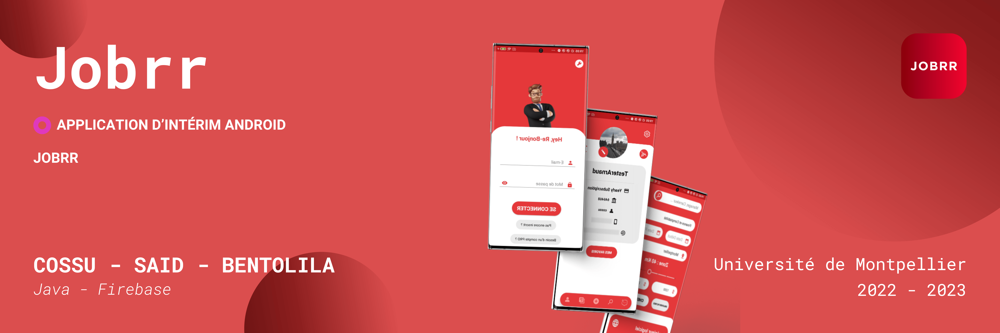
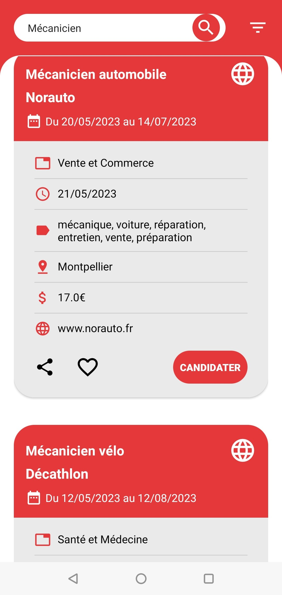
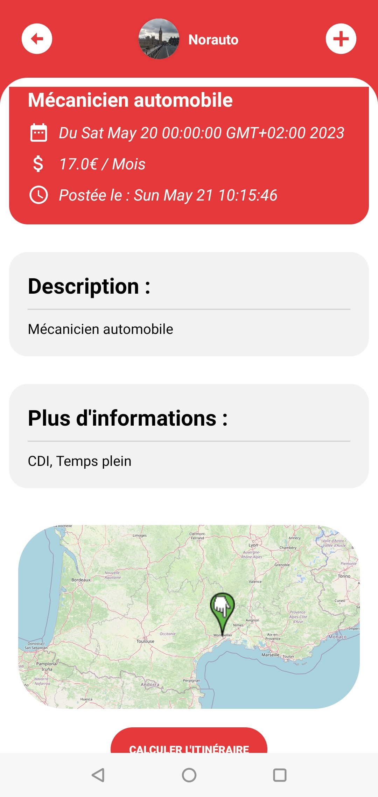
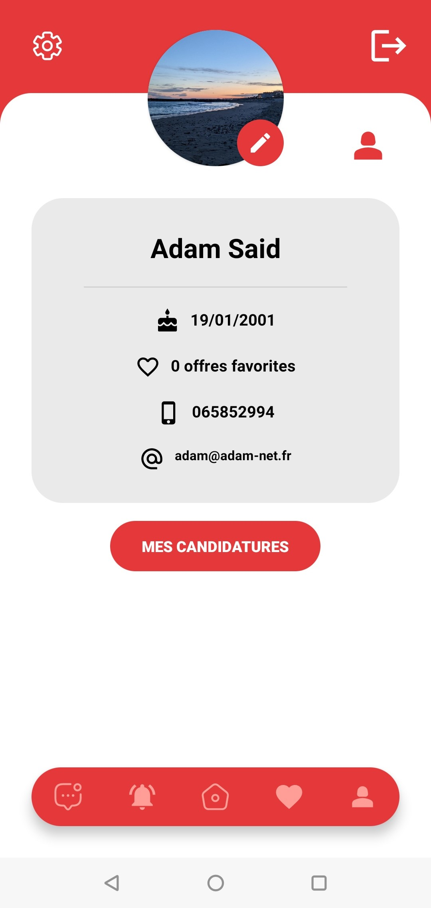
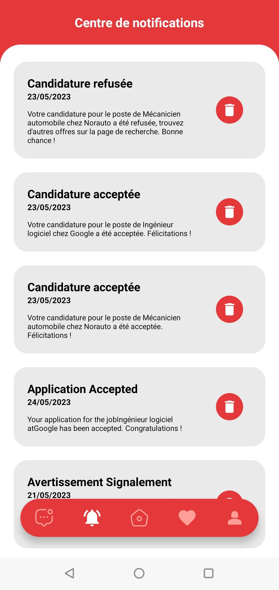
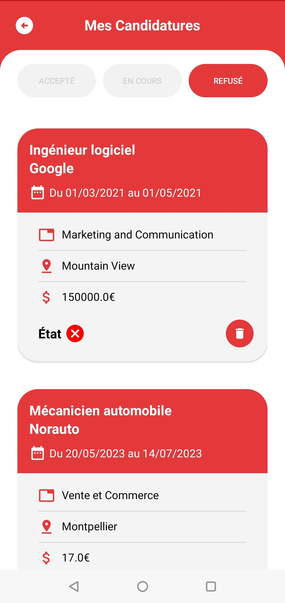
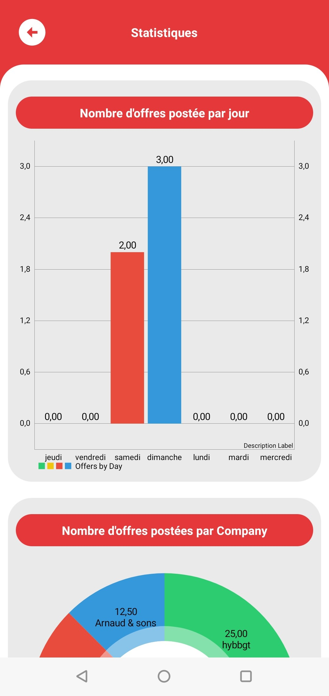

 JOBRR 

## HAI811I - Programmation mobile

### Intro
Ce projet présente l'application mise en place pour le projet de l'UE HAI811I de l'Université de Montpellier. Elle consiste en une application développée avec Android Studio en Java et un back-end Firebase permettant la mise en relation de chercheurs d'emplois en intérim et d'agences et entreprises proposant des offres. L'application gère les différents types d'utilisateur et leur permet d'ajouter et candidater à des offres et converser avec d'autres utilisateurs. L'app permet également des fonctionnalités plus poussées telles que les comptes admin, les signalement, blocages, filtres des offres, génération de lettres de motivation, gestion de fichiers et photos de profil...

La v1.0 de l'application est fonctionnelle et disponible dans la partie release du repo si vous souhaitez la tester.

## Fonctionnalités
Liste non exhaustive des fonctionnalités

- Mode clair/sombre
- Traduction anglais/français
- Création/connexion comptes PRO/user/admin
- Vérification téléphone par OTP
- Profil avec paramètres et photo de profil
- Edition profil
- Gestion de fichiers (CV et LM)
- Consultation d'offres
- Ajout d'offres par formulaire ou envoi de fichier JSON
- Candidatures à des offres
- Itinéraire vers le lieu de l'offre avec Google Maps
- Carte in-app du lieu
- Candidatures spontanée
- Filtrage des recherches d'offres
- Système d'enregistrements et favoris
- Système de conversation fonctionnel duo/groupe
- Système de blockage/signalement d'utilisateurs/offres
- Gestion des candidatures avec statut
- Centre de notification
- Générateur de lettre de motivation
- Partage d'offres
- Graphiques de statistiques

### Screenshot

Quelques screens de l'application

Page de login

Page d'accueil avec offres

Exemple d'une offres

Profil utilisateur

Centre des notifications utilisateur

Page des candidatures

Page des statistiques pour admin

## Auteurs

- [@adams](https://www.github.com/adam-said)
- [@arnaudcs](https://www.github.com/Arnaudcs)
- [@lanmark](https://www.github.com/lanmark1)

